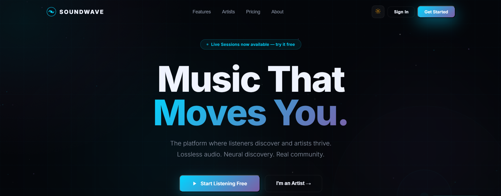
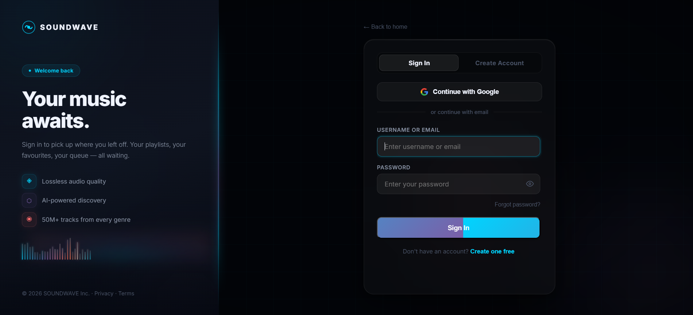
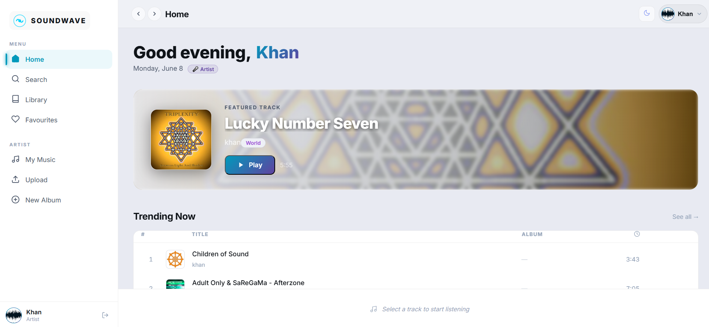
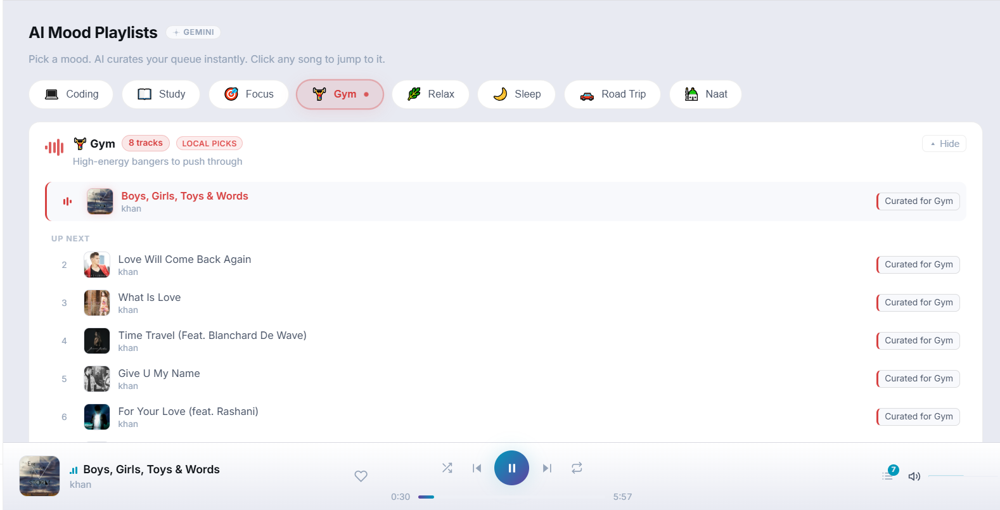
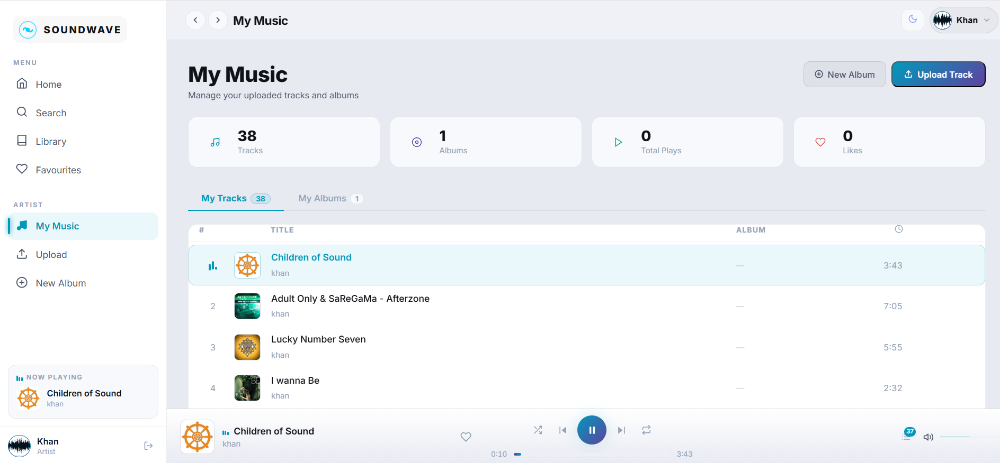

# 🎵 SOUNDWAVE Frontend

> A modern AI-powered music streaming platform built with React, Vite, and TailwindCSS.

SOUNDWAVE combines a Spotify-inspired user experience with modern web technologies, AI-assisted music discovery, Google OAuth authentication, dark/light themes, responsive design, and an advanced music player.

---
## 🎬 Demo Video

Watch SOUNDWAVE in action:

▶️ **[Demo Video](https://www.youtube.com/watch?v=256owMz5ZVk)**

The demo showcases:

- Landing Page & Animations
- Google OAuth Authentication
- JWT Authentication
- Music Streaming
- Queue Management
- Favorites System
- Album Creation
- Artist Dashboard
- Profile Management
- AI Mood Playlists powered by Gemini AI
- Dark / Light Theme System

---

## 📸 Screenshots

> **Tip for recruiters:** Screenshots and GIFs below give a quick feel for the app before diving into code.

### 🏠 Landing Page


### 🔐 Auth Page


### 🎵 Home Page


### 🤖 AI Mood Playlist


### 🎧 Music Player


> **How to add screenshots:**
> 1. Create a `screenshots/` folder in the project root.
> 2. Save each image there with the filenames shown above.
> 3. For GIFs, use a tool like [ScreenToGif](https://www.screentogif.com/) (Windows) or [Kap](https://getkap.co/) (Mac), then replace `.png` with `.gif` in the paths above.

---

## 🚀 Features

### Authentication & User Management

- JWT Authentication
- Google OAuth Login
- User Registration & Login
- Password Reset Flow
- Profile Management
- Profile Image Upload
- Role-Based Access Control
  - Listener
  - Artist

---

### Music Streaming

- Stream uploaded tracks
- Queue Management
- Play / Pause
- Next / Previous Track
- Volume Control
- Volume Persistence
- Shuffle Mode
- Repeat Mode
- Responsive Music Player

---

### AI Mood Playlist

Generate playlists based on mood selections such as:

- Coding
- Study
- Focus
- Gym
- Relax
- Sleep
- Road Trip
- Ramadan Naat

Powered by Google Gemini AI through the backend service.

---

### Artist Features

- Upload Tracks
- Create Albums
- Manage Music Library
- Artist Profiles
- Artist Discovery

---

### User Features

- Browse Songs
- Search Music
- Favorites System
- Album Exploration
- Queue Management
- Personalized Listening Experience

---

### User Experience

- Dark Mode / Light Mode
- Responsive Design
- Mobile-Friendly Layout
- Modern UI Animations
- Framer Motion Transitions
- Sidebar Navigation
- Top Navigation Bar
- Toast Notifications

---

## 🛠️ Tech Stack

### Frontend

- React
- Vite
- JavaScript (ES6+)
- TailwindCSS
- Context API
- React Router DOM
- Framer Motion
- Axios

### Authentication

- JWT
- Google OAuth

### AI Integration

- Google Gemini API (via Backend)

---

## 📂 Project Structure

```bash
src/
│
├── api/
│
├── assets/
│
├── components/
│   ├── AlbumCard.jsx
│   ├── ArtistCard.jsx
│   ├── NowPlayingBar.jsx
│   ├── Player.jsx
│   ├── QueueDrawer.jsx
│   ├── Sidebar.jsx
│   ├── TopBar.jsx
│   └── ...
│
├── context/
│   ├── AuthContext.jsx
│   ├── PlayerContext.jsx
│   ├── ThemeContext.jsx
│   └── ToastContext.jsx
│
├── pages/
│   ├── LandingPage.jsx
│   ├── AuthPage.jsx
│   ├── HomePage.jsx
│   ├── SearchPage.jsx
│   ├── LibraryPage.jsx
│   ├── UploadPage.jsx
│   ├── CreateAlbumPage.jsx
│   └── ...
│
├── App.jsx
├── main.jsx
└── index.css
```

---

## ⚙️ Installation

Clone the repository:

```bash
git clone https://github.com/Zeeshan0991/SoundWave-Frontend.git
```

Navigate to the project:

```bash
cd SoundWave-Frontend
```

Install dependencies:

```bash
npm install
```

Create environment variables:

```env
VITE_API_URL=YOUR_BACKEND_URL
VITE_GOOGLE_CLIENT_ID=YOUR_GOOGLE_CLIENT_ID
```

Start development server:

```bash
npm run dev
```

Build production version:

```bash
npm run build
```

Preview production build:

```bash
npm run preview
```

---

## 🔐 Environment Variables

Example:

```env
VITE_API_URL=http://localhost:5000
VITE_GOOGLE_CLIENT_ID=your_google_client_id
```

> ⚠️ Do **not** commit `.env` files to GitHub.

---

## 🌐 Backend Repository

This repository contains only the frontend application.

> 🔗 **[SoundWave Backend Repository](https://github.com/Zeeshan0991/SoundWave-Backend)**  


The backend handles:

- Authentication
- JWT Tokens
- MongoDB
- Track Management
- Album Management
- AI Mood Playlist Generation
- Google OAuth Verification
- Audio Streaming APIs

---

## 📱 Responsive Design

SOUNDWAVE supports:

- Desktop
- Tablet
- Mobile Devices

---

## 🎯 Learning Objectives

This project was built to strengthen skills in:

- React Development
- Modern UI/UX Design
- Authentication Systems
- Context API State Management
- AI Integration
- REST API Consumption
- Music Streaming Architecture

---

## 👨‍💻 Author

**Muhammad Zeeshan**

- GitHub: [Zeeshan0991](https://github.com/Zeeshan0991)
- LinkedIn: [linkedin.com/in/your-profile](https://www.linkedin.com/in/muhammadzeeshan06222/)

---

## 📄 License

This project is licensed under the [MIT License](./LICENSE).

---

## ⭐ Future Enhancements

- Real-Time Listening Activity
- Collaborative Playlists
- Advanced Recommendation Engine
- Listening Statistics Dashboard
- Social Features
- Multi-Language Music Discovery
- AI Playlist Continuation
- Mobile Application Version

---

If you found this project useful, consider giving it a ⭐ on GitHub!